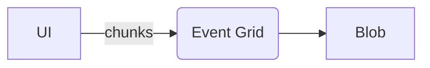
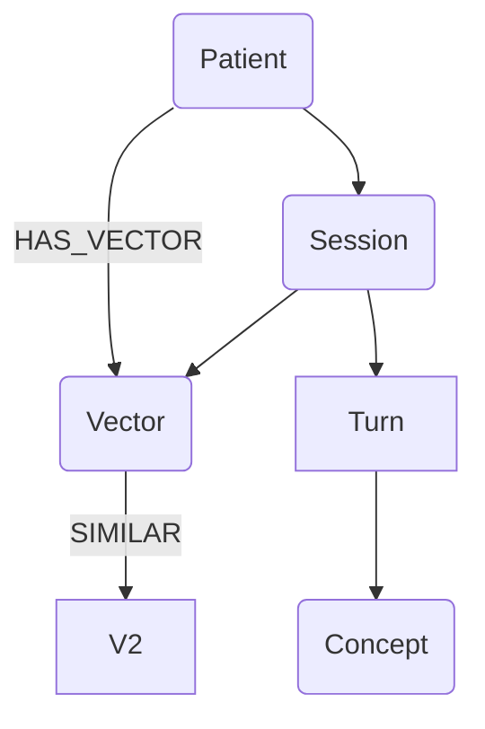

# HH – Pipeline de Embeddings, Ontologias, Parsings e Grafos

> Versão gerada automaticamente em 2025-04-22.

## 0. Finalidade  
Documentar o fluxo interno que converte a matéria‑prima de uma sessão clínica (áudio + metadados) em **representações vetoriais (10 dimensões)**, **conhecimento ontológico**, **parsing linguístico profundo** e **grafo relacional** persistente.

---

## 1. Captura & Ingestão  
* **Ponto de origem:** Interface HH (Web/Tablet) grava áudio PCM 48 kHz, anexa metadados (`patientId`, carimbo de data/hora, local).  
* **Transporte:** WebSocket seguro (`wss://api.hh.ai/ingest`) → Event Grid → Blob Storage (`raw-audio`).



---

## 2. Transcrição & Diarização  
* **Serviço:** `transcriber` (Azure Container Apps)  
* **Modelo:** Whisper‐large‐v3 + pyannote.  
* **Saída:** JSON com lista de turnos `{speaker,start,end,text}`.

```json
{
  "turns":[
    {"spk":"PAT","t0":1.3,"t1":4.2,"text":"Eu não consigo dormir..."},
    {"spk":"DOC","t0":4.3,"t1":5.1,"text":"Vamos entender melhor."}
  ]
}
```

---

## 3. Embeddings Dimensionalizados  
* **Prompt** enviado ao GPT‑4o (endpoint privado):  
  1. Coleção dos turnos do paciente.  
  2. Instruções para **estimar** `v₁..v₁₀` (ver Tabela 1) **e** fornecer razões textuais.  
* **Normalização:**  
  * Emocional → escala (–5 … +5) para valência, 0‑10 nos demais.  
  * Perspectiva temporal mapeada a –10…0…+10 (passado / presente / futuro).  
* **Persistência:** vetor `float32[10]` salvo em Azure Cognitive Search (`hh-index`) como `embedding` + campos auxiliares (`patientId`,`sessionId`).

---

## 4. Ontologia Dimensional
| ID | Dimensão | Meta‑estrutura | Definição operacional |
|----|----------|----------------|-----------------------|
| v₁ | Valência | Emocional | Polaridade hedônica (–5/+5) |
| v₂ | Excitação | Emocional | Ativação autonômica (0‑10) |
| v₃ | Dominância | Emocional | Controle percebido (0‑10) |
| v₄ | Intensidade | Emocional | Magnitude afetiva (0‑10) |
| v₅ | Complexidade | Cognitiva | Elaboração sintática (0‑10) |
| v₆ | Coerência | Cognitiva | Integração narrativa (0‑10) |
| v₇ | Flexibilidade | Cognitiva | Adaptabilidade (0‑10) |
| v₈ | Dissonância | Cognitiva | Conflito interno (0‑10) |
| v₉ | Persp. Temporal | Autonomia | –10 passado … 0 presente … +10 futuro |
| v₁₀ | Autocontrole | Autonomia | Regulação comportamental (0‑10) |

A ontologia reside em **Cosmos DB Gremlin** como vértices `Dimension` conectados por `BELONGS_TO` à meta‑estrutura.

---

## 5. Parsing Linguístico  
Pipeline spaCy + transformers: tokenização, POS, chunks, atos de fala e mapeamento de metáforas → slots HH.

---

## 6. Construção do Grafo  



---

## 7. Persistência e Consulta  

Vetores em Search, grafos em Gremlin, blobs arquivados. Query de trajetória:

```gremlin
g.V('PAT123').out('HAS_VECTOR').order().by('timestamp')
```

---

_Fim do documento_
